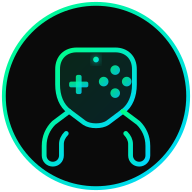

<p align="center">
  
</p>

<h1 align="center">ggLobby</h1>
<p align="center"><strong>Where Gamers Unite</strong></p>
<p align="center">The social platform built by gamers, for gamers. Find teammates, build clans, share your journey, and connect with a worldwide gaming community.</p>

<p align="center">
  <a href="#features">Features</a> &bull;
  <a href="#why-gglobby">Why ggLobby</a> &bull;
  <a href="#tech-stack">Tech Stack</a> &bull;
  <a href="#getting-started">Getting Started</a> &bull;
  <a href="#project-structure">Project Structure</a> &bull;
  <a href="#deployment">Deployment</a>
</p>

---

## What is ggLobby?

ggLobby is a **gaming-first social platform** that gives gamers a dedicated space to connect, compete, and grow together. Think of it as the place where your gaming identity lives — your profile showcases your ranks, stats, and achievements across every game you play, while the community features let you find teammates, join clans, and share content with people who speak your language.

Unlike general-purpose social networks where gaming is an afterthought, ggLobby is designed from the ground up around how gamers actually interact: finding the right teammates for ranked, organizing scrims, sharing clutch moments, and building lasting gaming friendships.

## Why ggLobby?

### The Problem

Gamers are fragmented across dozens of platforms:
- **Discord** is great for voice chat but terrible for discovering new people outside your existing servers.
- **Reddit** has gaming communities but no social networking — you can't build a profile, add friends, or find teammates.
- **Twitter/X** is noisy and not gaming-focused.
- **In-game social systems** are walled gardens — your Valorant friends can't see your CS2 rank.
- **LFG sites** are transactional — find a teammate, play once, never talk again.

There's no single place where your **entire gaming identity** lives and where you can **build real connections** with other gamers.

### The Solution

ggLobby combines everything a gamer needs in one platform:

| What You Need | How ggLobby Solves It |
|---------------|----------------------|
| Show off your skills | Unified profile with ranks & stats from all your games |
| Find teammates | LFG system with game, rank, and playstyle filters |
| Build a team | Clan system with roles, invites, and shared spaces |
| Stay connected | Real-time messaging, friend system, and activity feed |
| Share your journey | Blog & community posts with gaming-themed templates |
| Track your progress | XP, levels, badges, quests, and seasonal battle passes |
| Compete | Tournaments, challenges, and leaderboards |

### How is ggLobby Different?

| Feature | Discord | Reddit | Twitter | ggLobby |
|---------|---------|--------|---------|---------|
| Gaming profile with ranks | No | No | No | **Yes** |
| Find teammates (LFG) | Limited | Subreddit-based | No | **Built-in** |
| Clan/team management | Server-based | No | No | **Dedicated system** |
| Real-time messaging | Yes | No | DMs only | **Yes** |
| Blog/content publishing | No | Posts only | Threads | **Full blog with templates** |
| Achievement/progression system | Nitro badges only | Karma | No | **XP, levels, badges, quests** |
| Cross-game identity | No | No | No | **Unified profile** |
| Tournament system | Bots required | No | No | **Built-in** |
| Dark gaming aesthetic | Optional | No | No | **Native** |
| PWA (installable) | Electron app | No | PWA | **Yes** |

**In short:** ggLobby is what happens when you build a social network from scratch with gamers as the only audience. Every feature, every design decision, and every pixel is made for the gaming community.

## Features

### Core Social
- **Gamer Profiles** — Showcase your games, ranks, stats, bio, and achievements in one place
- **Friend System** — Send requests, follow players, track who's online
- **Real-time Messaging** — Direct messages and group conversations with read receipts
- **Voice & Video Calls** — Powered by LiveKit for low-latency communication
- **Activity Feed** — See what your friends and community are up to

### Teams & Community
- **Clans** — Create or join gaming clans with roles, invites, and member management
- **Community Hub** — Share memes, clips, discussions, and marketplace listings
- **LFG (Looking for Group)** — Find teammates filtered by game, rank, region, and playstyle
- **Tournaments** — Create and participate in community tournaments with brackets

### Content
- **Blog Platform** — Write guides, reviews, and stories with gaming-themed templates
- **Rich Text Editor** — Full editor with images, links, and formatting
- **Comments & Reactions** — Engage with posts through comments and likes

### Gamification
- **XP & Leveling** — Earn XP for everything you do on the platform
- **Badges & Achievements** — Unlock badges for milestones and accomplishments
- **Daily & Weekly Quests** — Stay engaged with quest objectives and rewards
- **Battle Pass** — Seasonal content tracks with free and premium tiers
- **Titles & Frames** — Customize your profile with earned cosmetics

### Platform
- **Progressive Web App (PWA)** — Install on any device, works offline
- **Dark Mode** — Sleek gaming aesthetic with neon green, cyan, and magenta accents
- **Responsive Design** — Optimized for desktop and mobile
- **Premium Tier** — Optional subscription for cosmetic enhancements (ggLobby Pro)
- **Admin Dashboard** — Content moderation and user management tools

## Tech Stack

| Layer | Technology |
|-------|-----------|
| **Framework** | [Next.js 16](https://nextjs.org) (App Router) |
| **Language** | [TypeScript](https://www.typescriptlang.org/) |
| **Styling** | [Tailwind CSS 4](https://tailwindcss.com/) |
| **Database** | [PostgreSQL](https://www.postgresql.org/) (self-hosted on VPS) |
| **Authentication** | [Auth.js](https://authjs.dev/) (email + OAuth) |
| **Real-time** | [Socket.io](https://socket.io/) (WebSocket) |
| **State Management** | [Zustand](https://zustand-demo.pmnd.rs/) + [React Query](https://tanstack.com/query/latest) |
| **Animations** | [Framer Motion](https://www.framer.com/motion/) |
| **UI Components** | [Radix UI](https://www.radix-ui.com/) + Custom gaming-themed components |
| **Rich Text** | [Tiptap](https://tiptap.dev/) |
| **Voice/Video** | [LiveKit](https://livekit.io/) |
| **Payments** | [Stripe](https://stripe.com/) |
| **Testing** | [Jest](https://jestjs.io/) + [Playwright](https://playwright.dev/) |
| **Icons** | [Lucide](https://lucide.dev/) |

## Getting Started

### Prerequisites

- [Node.js](https://nodejs.org/) 18.17 or later
- A [PostgreSQL](https://www.postgresql.org/) database (self-hosted or managed)
- npm, yarn, or pnpm

### Installation

```bash
# Clone the repository
git clone https://github.com/yourusername/gglobby.git
cd gglobby

# Install dependencies
npm install

# Set up environment variables
cp .env.example .env.local
# Edit .env.local with your database and Auth.js credentials
```

### Environment Variables

See [`.env.example`](.env.example) for the full list. At minimum you need:

```env
DATABASE_URL=your_postgresql_connection_string
AUTH_SECRET=your_auth_js_secret
NEXTAUTH_URL=http://localhost:3000
```

### Database Setup

Apply the database migrations in order:

```bash
# Apply migrations to your PostgreSQL database
# Files are in supabase/migrations/ — apply in numerical order
```

### Development

```bash
npm run dev
```

Open [http://localhost:3000](http://localhost:3000) in your browser.

### Scripts

| Command | Description |
|---------|-------------|
| `npm run dev` | Start development server (Turbopack) |
| `npm run build` | Build for production |
| `npm run start` | Start production server |
| `npm run lint` | Run ESLint |
| `npm test` | Run unit tests (Jest) |
| `npm run test:watch` | Run tests in watch mode |
| `npm run test:coverage` | Run tests with coverage report |
| `npm run e2e` | Run end-to-end tests (Playwright) |
| `npm run e2e:ui` | Run E2E tests with UI |

## Project Structure

```
gglobby/
├── src/
│   ├── app/                    # Next.js App Router pages
│   │   ├── (auth)/             # Auth pages (login, register, onboarding)
│   │   ├── (main)/             # Main app pages (behind auth)
│   │   │   ├── community/      # Community feed & posts
│   │   │   ├── clans/          # Clan listing & detail pages
│   │   │   ├── dashboard/      # User dashboard with stats
│   │   │   ├── find-gamers/    # LFG / gamer discovery
│   │   │   ├── friends/        # Friends, followers, following
│   │   │   ├── messages/       # Real-time messaging
│   │   │   ├── profile/        # User profiles & editing
│   │   │   ├── settings/       # App settings & connections
│   │   │   └── write/          # Blog post editor
│   │   ├── admin/              # Admin dashboard
│   │   ├── api/                # API routes
│   │   ├── blog/               # Public blog pages
│   │   ├── privacy/            # Privacy Policy
│   │   ├── terms/              # Terms of Service
│   │   └── guidelines/         # Community Guidelines
│   ├── components/             # React components (226 files)
│   │   ├── ui/                 # Base UI components (Button, Card, Avatar, etc.)
│   │   ├── layout/             # AppShell, Sidebar, Navbar
│   │   ├── profile/            # Profile display components
│   │   ├── blog/               # Blog editor & rendering
│   │   ├── chat/               # Messaging components
│   │   ├── clans/              # Clan management UI
│   │   ├── community/          # Community feed cards
│   │   ├── friends/            # Friend cards & requests
│   │   └── ...                 # More feature components
│   ├── lib/                    # Utilities & business logic
│   │   ├── auth/               # Auth context provider
│   │   ├── hooks/              # Custom React hooks (58 files)
│   │   ├── supabase/           # Database client setup
│   │   ├── theme/              # Theme system
│   │   └── utils/              # Helper functions
│   └── types/                  # TypeScript type definitions
├── public/                     # Static assets & PWA icons
├── supabase/                   # PostgreSQL migrations (60+ files)
├── mobile/                     # React Native / Expo mobile app
└── ROADMAP/                    # Project roadmap & planning docs
```

## Deployment

ggLobby is designed to deploy on a self-hosted VPS:

1. Push your repo to GitHub
2. Set up your VPS with Node.js, PostgreSQL, and a reverse proxy (e.g., Nginx/Caddy)
3. Configure all environment variables from `.env.example`
4. Deploy — use PM2 or Docker for process management, Cloudflare for CDN and SSL

### Production Checklist

- [ ] All environment variables configured
- [ ] PostgreSQL database with migrations applied
- [ ] Custom domain configured with DNS
- [ ] Stripe webhooks pointed to production URL
- [ ] OAuth redirect URLs updated in Auth.js configuration
- [ ] RLS policies reviewed and enabled on all tables

## Why It's Worth Trying

- **It's free.** All core social features are free forever. No paywalls on messaging, LFG, or clans.
- **It's fast.** Built on Next.js 16 with Turbopack, optimized queries, and edge-ready architecture.
- **It's beautiful.** A dark, neon-accented gaming aesthetic that feels like home for gamers.
- **It's yours.** Open source. Self-hostable. Your data, your rules.
- **It solves a real problem.** Gamers deserve a social platform built specifically for them — not a gaming tab bolted onto a general-purpose network.

## License

Copyright &copy; 2026 ggLobby. All rights reserved.
